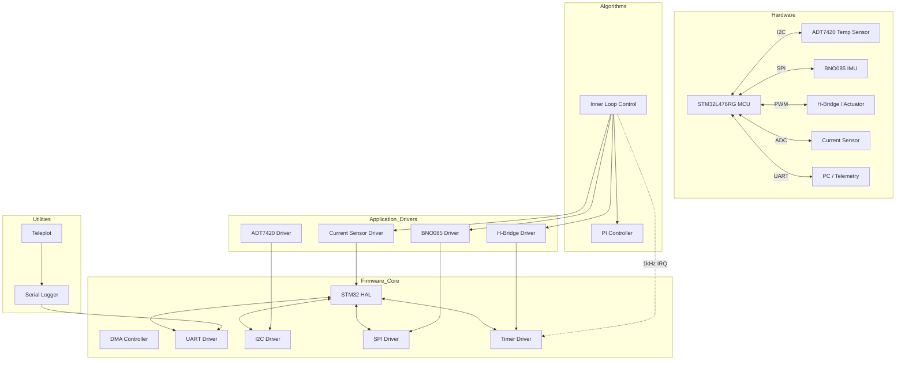
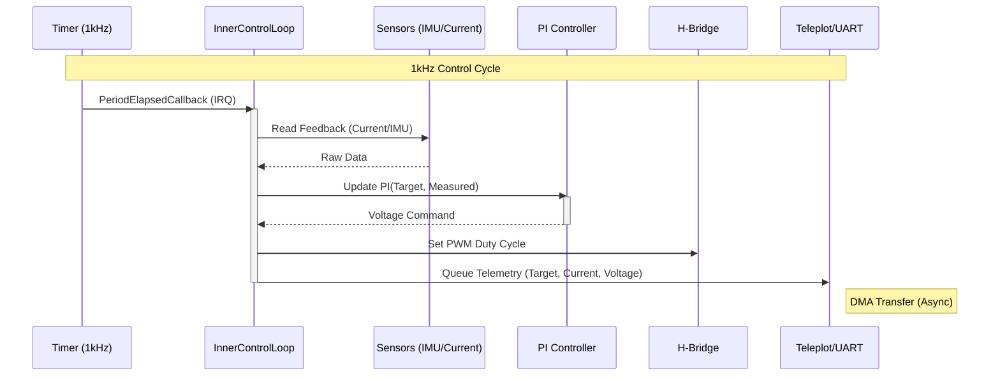

# CubeSat Nucleo Firmware

Firmware for the CubeSat Magnetorquer Control System, running on the **STM32L476RG Nucleo** board. This project implements a high-frequency (1kHz) current control loop for magnetorquers, along with sensor integration for attitude determination.

## Architecture

The system is built on the STM32 HAL, with a layered architecture separating hardware drivers from control algorithms.

<details>
<summary>Click to view Architecture Diagram</summary>


</details>

### Data Flow

The **Inner Control Loop** runs at 1kHz (triggered by TIM6), reading sensors, executing the PI controller, and updating the H-Bridge PWM commands.

<details>
<summary>Click to view Data Flow Diagram</summary>


</details>

## Features

- **Inner Loop Control**: Quick-response PI controller for magnetorquer current regulation (`Application/Algorithms/`).
- **IMU Integration**: BNO085 driver support for Rotation Vector, Gyroscope, and Magnetometer data.
- **Temperature Sensing**: ADT7420 High-Accuracy Digital Temperature Sensor.
- **Telemetry**: Real-time plotting support via [Teleplot](https://teleplot.fr/) over UART DMA.

## Documentation

- [Telemetry & Control Interfaces](./cube_sat_nucleo/api-endpoints.md)
- [Project Architecture](./cube_sat_nucleo/architecture.mmd)

## Project Structure

```text
├── Core/                   # STM32 HAL System Initialization & Interrupts
│   ├── Src/main.c         # Application Entry & Loop
│   └── Src/serial_log...  # DMA-driven UART Logger
├── Application/
│   ├── Drivers/           # Hardware Drivers
│   │   ├── imu_bno085.c   # BNO085 IMU Driver
│   │   ├── adt7420.c      # ADT7420 Temp Sensor
│   │   └── hbridge.c      # PWM H-Bridge Control
│   └── Algorithms/        # Control Logic
│       ├── pi_controller.c # Proportional-Integral Controller
│       └── inner_loop...  # Main Control Loop State Machine
└── Drivers/               # STM32 CMSIS & HAL Drivers
```

## Recent Changes

- **Control Loop**: Implemented and tuned Inner Loop PI controller; added Open Loop testing flags.
- **Sensors**: Added retry logic for IMU activation; Thermocouple testing completed.
- **Comms**: Fixed Serial Output buffer issues; Implemented DMA-based logging.
- **Config**: Cleaned up `.gitignore` and build artifacts.
