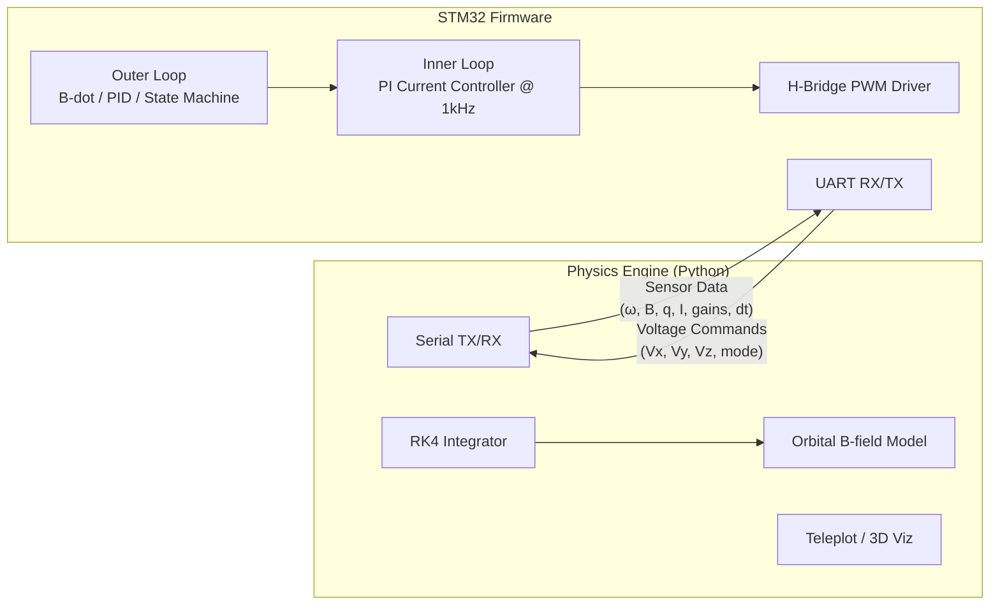

# CubeSat ADCS — Firmware + HITL Simulation

Firmware and simulation environment for a **CubeSat Attitude Determination and Control System (ADCS)** using magnetorquer-only actuation, running on the **STM32L476RG Nucleo** board.

## System Overview

The project implements a full closed-loop ADCS with three operational modes:

| Mode | Algorithm | Purpose |
|---|---|---|
| **Detumble** | Gyro-based B-dot (`M = k·(ω×B)`) | Reduce tumble rate from deployment |
| **Spin Stabilization** | Y-axis torque controller | Establish gyroscopic stiffness |
| **Inertial Pointing** | Quaternion-error PID + magnetic projection | Align body Z-axis to a target direction |

A Python-based **Hardware-in-the-Loop (HITL)** simulation provides real-time physics feedback over UART, allowing control algorithm development and testing without physical rotation.

## Architecture



### Data Flow

1. **Python** sends simulated sensor readings (gyro, mag, quaternion, current feedback, gains, dt) to firmware.
2. **STM32 Outer Loop** determines ADCS mode and computes a dipole request.
3. **STM32 Inner Loop** converts the dipole request to target currents and runs PI control at 1kHz.
4. **STM32** returns commanded voltages + ADCS mode to Python.
5. **Python** applies voltages to the physics model (RK4 with RL circuit sub-stepping), updates state, and loops.

## Project Structure

```text
├── README.md                           # This file
├── project-plan.md                     # Roadmap & status
├── docs/
│   ├── stage1_physics.md               # Physics engine design
│   ├── stage2_firmware.md              # Control algorithm design
│   ├── simulation_parameters.md        # Tuning guide
│   └── features/hitl_framework.md      # HITL debugging walkthrough
├── physics_engine/
│   ├── physics.py                      # Satellite dynamics (RK4 + RL circuits)
│   ├── simulation_host.py              # Main HITL loop & CLI
│   ├── comms.py                        # Binary serial protocol
│   └── telemetry.py                    # Teleplot & 3D visualization
└── cube_sat_nucleo/
    ├── Core/
    │   ├── Inc/main.h                  # Packet structs (SimPacket_Input/Output)
    │   └── Src/main.c                  # Application entry & UART dispatch
    └── Application/
        ├── Algorithms/
        │   ├── Inc/config.h            # All control gains
        │   ├── Inc/outer_loop_control.h
        │   ├── Src/outer_loop_control.c  # ADCS state machine + control laws
        │   ├── Src/inner_loop_control.c  # PI current loop
        │   └── Src/math_lib.c            # Vec3/Quat math utilities
        └── Drivers/
            ├── Src/hbridge.c           # PWM H-Bridge driver
            └── Src/current_sensor.c    # ADC current feedback
```

## Quick Start

### Prerequisites
- STM32CubeIDE (for firmware build + flash)
- [uv](https://github.com/astral-sh/uv) (Python dependency manager)
- Nucleo-L476RG connected via USB

### Run HITL Simulation

```bash
cd physics_engine
uv sync

# Detumble test (high initial spin)
uv run simulation_host.py --scenario detumble --initial_omega 1.0 1.0 1.0

# Pointing test (180° flip recovery)
uv run simulation_host.py --scenario pointing --kp 0.1 --kd 0.1

# Debug mode (print ω, B, m every second)
uv run simulation_host.py --scenario detumble --debug

# Real-time speed (1s steps)
uv run simulation_host.py --realtime
```

### Key CLI Flags

| Flag | Default | Description |
|---|---|---|
| `--scenario` | `detumble` | `detumble` or `pointing` |
| `--initial_omega WX WY WZ` | scenario-dependent | Initial angular velocity (rad/s) |
| `--kbdot` | `200000.0` | B-dot gain (sent to firmware at runtime) |
| `--kp` / `--ki` / `--kd` | `0.1` / `0.0001` / `0.1` | PID gains for pointing mode |
| `--dt` | auto (0.1s fast / 1.0s realtime) | Physics step size |
| `--open-loop` | off | Bypass PI controller (V=I·R) |
| `--debug` | off | Print ω, B-field, dipole moment each second |

## Documentation

| Document | Description |
|---|---|
| [Project Plan](./project-plan.md) | Roadmap, status, and phase breakdown |
| [Physics Design](./docs/stage1_physics.md) | Mathematical model and integration |
| [Firmware Design](./docs/stage2_firmware.md) | Control modes and state machine |
| [Simulation Parameters](./docs/simulation_parameters.md) | Tuning guide and stress tests |
| [HITL Framework](./docs/features/hitl_framework.md) | Debugging history |
| [Physics Engine README](./physics_engine/README.md) | Protocol and usage details |

## Hardware

| Component | Part | Interface |
|---|---|---|
| MCU | STM32L476RG (Cortex-M4) | — |
| IMU | BNO085 (9-DOF) | SPI |
| Actuator Driver | DRV8833 Dual H-Bridge | Timer/PWM |
| Temperature | ADT7420 (PmodTMP2) | I2C |
| Magnetorquers | Inductive coils (R=28Ω, L≈12–25mH) | H-Bridge |
