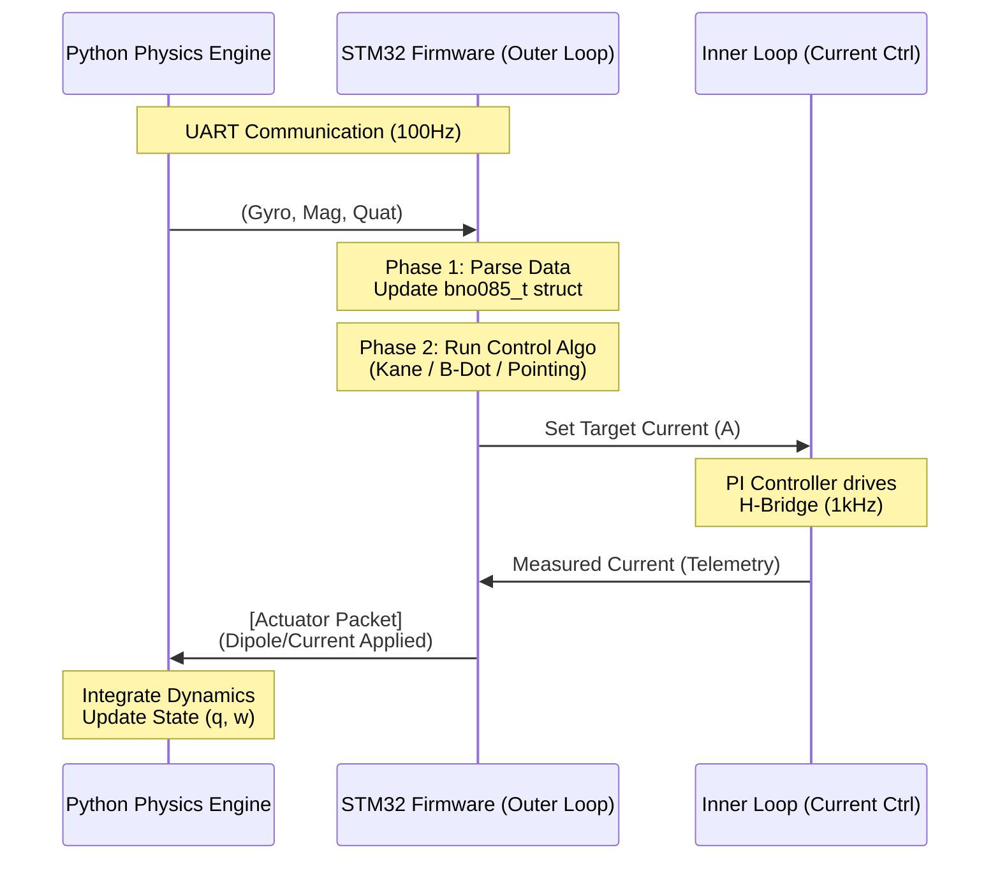

# agents.md

## Project: CubeSat Magnetic Attitude Control System (M-ACS) implementation

### 1. System Architecture & Dataflow Overview

The system operates in a **Hardware-in-the-Loop (HITL)** configuration. The **STM32 Firmware** runs the actual flight code, while a **Python Physics Engine** simulates the spacecraft dynamics and environment, communicating sensor inputs and actuator outputs over UART.

---

### 2. Implementation Stage 1: Physics Engine (Python)

**Goal:** Create a simulation environment that models Rigid Body Dynamics to test the flight software before deployment.

**[Detailed Specification](docs/stage1_physics.md)**

#### A. Mathematical Model
See [Stage 1 Docs](docs/stage1_physics.md#a-mathematical-model).

#### B. Data Handler & Communication
See [Stage 1 Docs](docs/stage1_physics.md#b-data-handler--communication).

#### C. Deliverables
See [Stage 1 Docs](docs/stage1_physics.md#c-deliverables).

---

### 3. Implementation Stage 2: Control Algorithms (STM32 Firmware)

**Goal:** Implement the "Brain" of the ADCS. This module takes sensor data and outputs current commands. It must switch between three distinct modes.

**[Detailed Specification](docs/stage2_firmware.md)**

#### Data Structures
See [Stage 2 Docs](docs/stage2_firmware.md#data-structures).

#### Mode A: Detumbling (B-Dot)
See [Stage 2 Docs](docs/stage2_firmware.md#mode-a-detumbling-b-dot).

#### Mode B: Spin Stabilization (Virtual Kane Damper)
See [Stage 2 Docs](docs/stage2_firmware.md#mode-b-spin-stabilization-virtual-kane-damper).

#### Mode C: Inertial Pointing (PD Controller)
See [Stage 2 Docs](docs/stage2_firmware.md#mode-c-inertial-pointing-pd-controller).

#### D. Deliverables
See [Stage 2 Docs](docs/stage2_firmware.md#d-deliverables).

---

### 4. Integration & Validation Plan

1. **Open Loop Test:**
* Run Python Physics Engine with `Torque = 0`.
* Verify STM32 receives Gyro/Mag data that matches the "tumbling" simulation.

2. **Polarity Check (Critical):**
* Manually force a spin in Python.
* Verify STM32 B-Dot outputs a dipole that **opposes** the change in B-field. (If it reinforces, sign flip is needed).

3. **Kane Damper Tuning:**
* Inject initial tumble in Python.
* Enable Kane Mode on STM32.
* Tune $c_{damp}$ (damping) until convergence to major-axis spin is smooth (no oscillations).
* Tune $I_d$ (virtual inertia) to control the final spin rate stability.

---

### Citations for Coding Agents

* **Kane & Barba:** Kane Damper equations and stability proofs.

* **Psiaki & IT:** PD Controller and Quaternion Feedback derivation.

* **Avanzini:** B-Dot implementation details.

