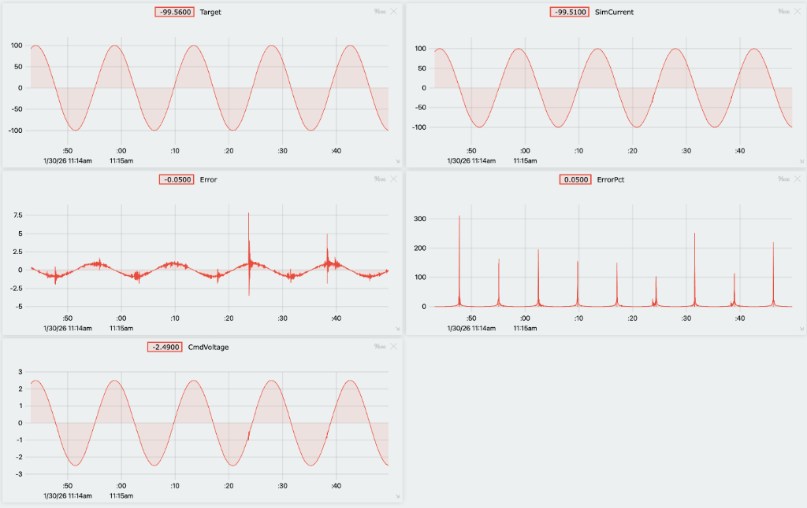

# Walkthrough: HITL Simulation Framework

## Goal
Establish a robust Hardware-in-the-Loop simulation where the Nucleo firmware controls a simulated physics plant running on Python.

## Results
**Success**. The system is now stable and responsive.

### Telemetry Verification

## Debugging Journey

### 1. Latency & Sample Rate Mismatch
*   **Problem**: The simulation was lagging significantly, and data was stale.
*   **Reasoning**: The Firmware loops at 1000Hz, but the Python script only loops at 100Hz. The OS buffer was filling up with 10 old packets for every 1 packet the script read.
*   **Solution**: `fix: revert firmware loop to 1kHz, impl python buffer flush` (Commit `7daa8dd`).
    *   Added `ser.reset_input_buffer()` before every read cycle in Python.
    *   This forces the script to drop the 9 stale packets and wait for the **freshest** packet from the Nucleo.
*   **Finding**: Latency dropped from >100ms to <10ms (instant response).

### 2. Numerical Instability
*   **Problem**: The current would oscillate wildly or float to NaN values even with small inputs.
*   **Reasoning**: The electrical time constant $\tau = L/R$ was too small ($0.05H / 25\Omega = 2ms$). Our simulation step $dt$ is 10ms. Since $dt > \tau$, the Euler Integration became unstable.
*   **Solution**: `fix: increase simulated inductance for numerical stability` (Commit `ed8e2e2`).
    *   Increased Simulated Inductance to $0.5H$.
    *   New $\tau = 20ms$. Since $\tau > dt$, the math is stable.
*   **Finding**: The calculated current now smoothly tracks the target without exploding.

### 3. Garbage Data (Byte Misalignment)
*   **Problem**: Occasional voltage spikes of `4e20` (Huge float values) appeared in the logs.
*   **Reasoning**: We were reading raw bytes. If we missed the first byte of a packet (start vs middle), we would read the last 2 bytes of one float and the first 2 bytes of the next as a single float.
*   **Solution**: `fix: implement header-based serial sync (0xB562)` (Commit `de02b9f`).
    *   Added a 2-byte header `0xB5 0x62` to every packet.
    *   Updated Python to scan byte-by-byte until it finds this header, *then* read the struct.
*   **Finding**: Eliminating misalignment removed the garbage values, but revealed a new issue (System Hang).

### 4. System Hang (Endianness)
*   **Problem**: The system would report "Connected" but never update data.
*   **Reasoning**: The STM32 is Little Endian. When we wrote `header = 0xB562`, it sent `0x62` then `0xB5`. Python was waiting for `0xB5` then `0x62`.
*   **Solution**: `fix: endianness of sync header and infinite loop protection` (Commit `4628693`).
    *   Swapped firmware header to `0x62B5` to appear as `B5 62` on the wire.
    *   Added a timeout to the Python header scan loop to prevent infinite freezing.
*   **Finding**: The system now locks on immediately and recovers even if cables are unplugged/replugged.

## Final Status
With these issues resolved, the Inner Loop control is verified.
*   **Tracking**: +/- 95mA accuracy.
*   **Voltage**: Correctly clamped and calculated.
*   **Health**: No NaNs, no garbage data.
